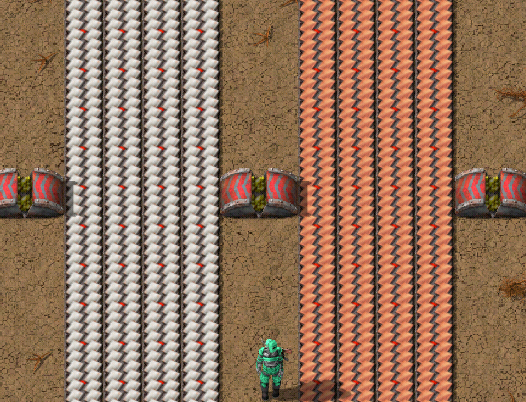
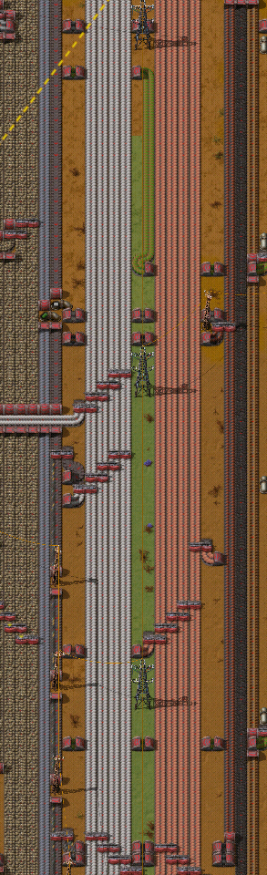
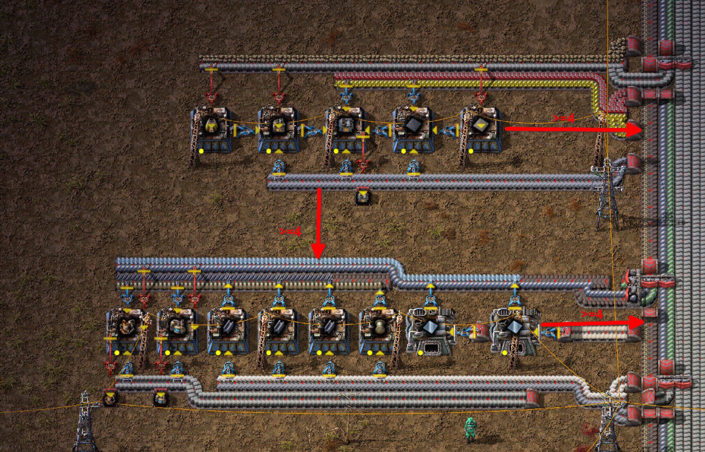
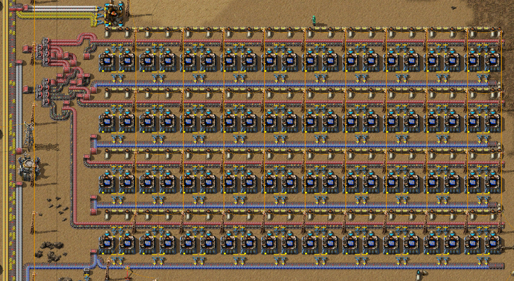

# Bus Design Guidelines

These are generally agreed upon tips for effective design in the main bus organizational model.

This is a living document and will be updated regularly.

## 1: Bus Design

> 1.1: Keep belts of similar material together.

Good:

> 1.2: Keep belt groups thinner than the commonly used underground length, and gaps between groups at least two tiles wide.

Good:

Bad:

As you can see, the red underground is not long enough to reach the other side of the belt group.

> 1.3: Don't bus high bandwidth intermediates.

High bandwidth intermediates are intermediate products which have higher item counts than their ingredients
and are usually produced from one ingredient type. A good vanilla example is copper wire, which is best produced in
near the production block of a recipe that needs it.

> 1.4: Run power down the bus.

Good:

Gaps in the bus are already at least two tiles wide, so a big power pole can fit in that space.

## 2: Production Design

> 2.1: Keep at least 4 tiles of spacing between the bus and adjacent production areas

Good:

> 2.2: Organize mass production blocks in rows, with ad-hoc setups on the side for low bandwidth items produced on-site.

Good:

In this example, the sulfuric acid only requires one chemical plant, so it does not need to be organized in rows.
The blue circuits are organized into rows due to the number of assemblers required.

> 2.3: Organize mixed-item production with a mini-bus.

There is only a single row of assemblers in the middle, producing different items. The three tiles
above and below them run a "mini-bus" to transport input ingredients and intermediates within the block.
This type of setup is normally used for malls.

While this setup does branch from a mini-bus, bus design guidelines were not followed in designing
the production setups.

> 2.4: Only buffer items in malls.

In a well-ratio'd production block, intermediates are consumed roughly as fast as they are produced.
Thus, having a buffer will not increase rates.

Buffers also absorb load spikes, which is advantageous in a mall or train logistic setup, but are
disadvantageous when trying to identify bottlenecks.

## 3: Bus Splitting and Balancing

> 3.1: Use cascaded splitters to split one belt off the bus.

Good:

> 3.2: Split different lanes to pull multiple resources off the bus.

Good:

