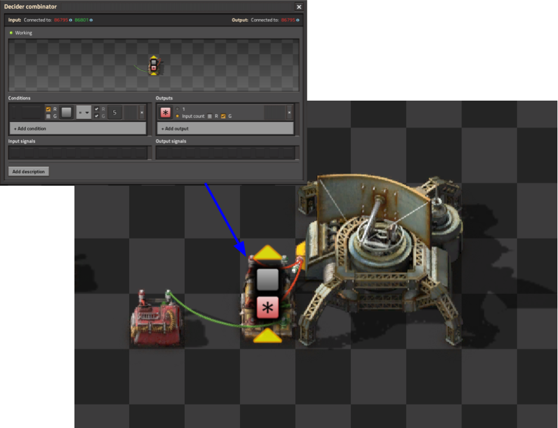
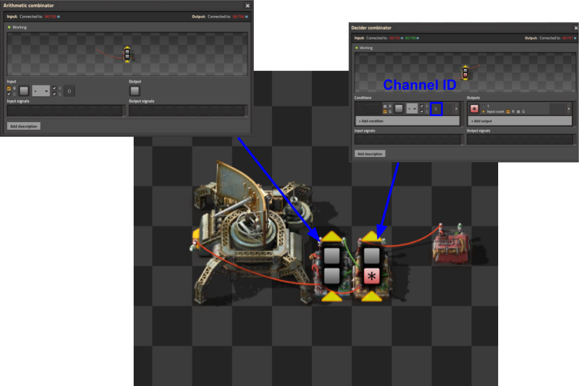
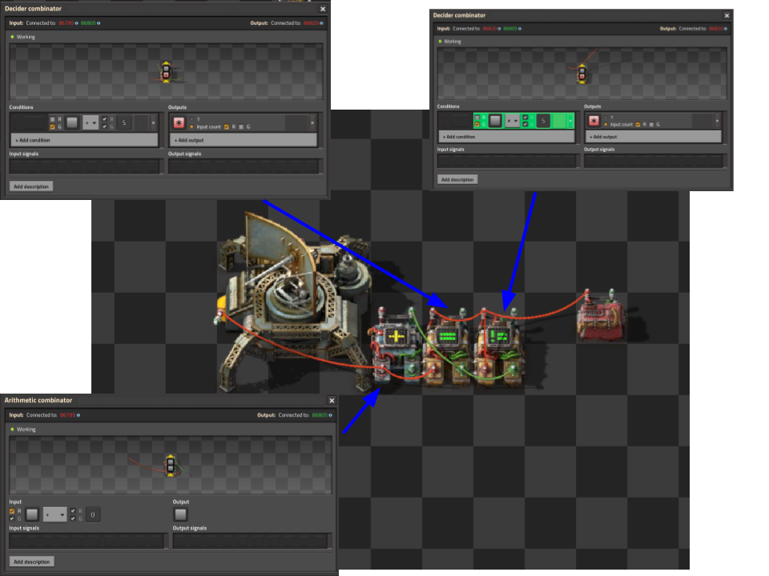

# RFC 7+1i: Quality and Time-division Multiplexing for Radar Circuits

> Draft 1

## 0. Terminology

- _Italics_ will be used when introducing new terms.
- A _channel_ is a separate set of signals that can be transmitted in isolation from other channels
  over a common medium.
- A _node_ is a circuit that transmits or receives signals in channels.

## 1. Motivation

Factorio 2.0 added a simple method of transmitting circuits over long distances: simply wire it
to a radar. However, this presents a problem for extension. An protocol that transmits typed item
signals on the radar prevents the development and use of alternative protocols using the radar.

This document outlines multiplexing methods for carrying multiple channels over a single wire,
or the radar circuit network.

## 2. Quality Multiplexing

Every signal in Factorio has a quality level associated with it, and different qualities of the same signal type
are considered separate signals. This includes entities which normally cannot have associated quality, such as
fluids or virtual signals. This leads to an simple multiplexing strategy: simply convert all signals to a different quality.
This strategy is known as _quality multiplexing_ (QM).

Limitations include being limited to 5 different channels (one for each quality level) and discarding all quality
information in the channel.

## 3. Time-division Multiplexing

_Time-division multiplexing_ (TDM) is a method where each channel is given a _time-slice_, and the channel can only operate during that
time-slice.

### Protocol

Time-slices are defined by a channel-select signal on the bus, which is transmitted on the virtual signal "Grey signal".
Each channel is given a signed 32-bit channel ID. When the value of the channel-select signal equals a given channel's ID,
that channel will be "active" on the next tick. This is to allow 1 tick of latency for transmitters to turn themselves on.

_Fig. 3.1: Example timing diagram for TDM_
```
| Tick #         | 1  | 2  | 3  | 4  | 5  | 6  | 7  | 8  | 9  |
|----------------|----|----|----|----|----|----|----|----|----|
| Channel-select | 0  | 0  | 0  | 10 | 4  | 4  | 5  | 4  | 5  |
| Active Channel | -  | 0  | 0  | 0  | 10 | 4  | 4  | 5  | 4  |
```

_Fig. 3.2: Example timing diagram for TDM_
```
| Tick #         | 1  | 2  | 3  | 4  | 5  | 6  | 7  | 8  | 9  |
|----------------|----|----|----|----|----|----|----|----|----|
| Grey Signal    | 4  | 5  | 6  | 7  | 0  | 1  | 2  | 3  | 4  |
| Active Channel | -  | 4  | 5  | 6  | 7  | 0  | 1  | 2  | 3  |
```

The _channel controller_ is responsible for generating the channel-select signal, and only one should exist
per surface. Bus controllers can generate any sequence of channel-select signals as desired, so nodes
must be able to handle it. For example, channel-select signals might not be monotonically increasing and
may remain on the same value for 1 tick or 1000 ticks.

This flexibility allows debugging a single channel by overriding the channel controller to only select that channel.

Nodes can contain transmit circuits, receive circuits, or both. Receive circuits can hold the signals when
the channel is inactive in order to present some data to the circuits, even if not accurate.

### Reference Implementation

_Fig. 3.3: Example transmit circuit_


_Fig. 3.4: Example receive circuit (without holding)_


_Fig. 3.5: Example receive circuit (with holding)_


### Limitations

Limitations of TDM include increased latency. Signals must wait for their time-slice to transmit on the channel, making it
unsuitable for low-latency communication.